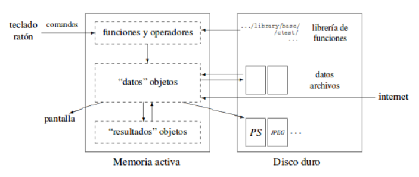
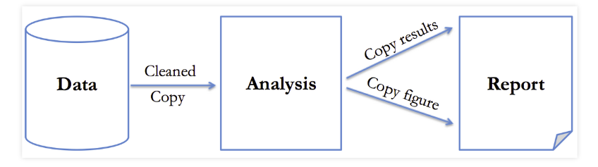
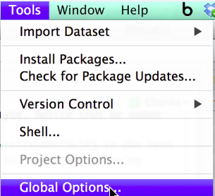
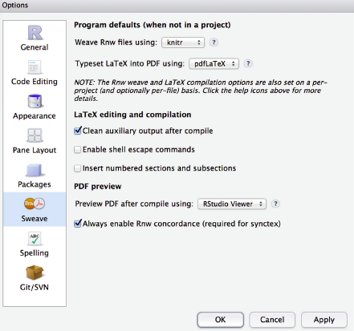
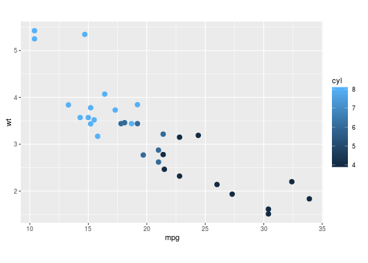

R y Knitr
========================================================


 R
========================================================

- [R](http://cran.r-project.org/) es un lenguaje y un  entorno para computación  y gráficos estadísticos.
- R ofrece una amplia variedad de estadística (lineal y modelado no-lineal, test estadísticos, análisis de series temporales...) y las técnicas gráficas que ofrece son  altamente extensibles.
- [rseek](http://www.rseek.org/) facilita la búsqueda de información de R.
- R hereda de S  (un entorno y lenguaje que se ha desarrollado por Lucent Technologies) muchas propiedades incluyendo la   orientación a objetos y el aspecto funcional.

Algunas caracteristicas de  R
========================================================

- Como lenguaje de programación bien desarrollado,  incluye condicionales, bucles, funciones recursivas definidas por el usuario y facilidades de entrada y salida.
- Posee facilidades gráficas para el análisis y visualización de datos ya sea en pantalla o en copia impresa.
- R permite para tareas computacionalmente intensivas, vincular lenguajes como C, C++ o Fortran en tiempo de ejecución y mejorar el proceso computacional.

 Funcionamiento de R
========================================================


- Todas las acciones en R se realizan con objetos que son guardados en la memoria activa del ordenador, sin usar archivos temporales.


Funcionamiento de R(1)
========================================================

- La lectura y escritura de archivos solo se realiza para la entrada y salida de datos y resultados.

- Archivos que contengan datos pueden ser leídos directamente desde el disco local o en un servidor remoto a través de la red.

- Mayor información de R, se puede encontrar en el libro de Hadley Wickham [Advanced R](http://adv-r.had.co.nz/).


Preparando un reporte
========================================================

- Un reporte se produce con el análisis de los datos obtenidos. 
- Los datos y el análisis utilizan algún tipo de software estadístico.
- Para escribir reportes estadísticos:
 - Se incorpora el análisis en el informe, en mejor de los casos en forma de reportes dinámicos que se actualicen automáticamente!



 knitr
========================================================

- Yihui Xie, creador de Knitr, menciona que knitr  fue diseñado para ser una máquina de generación dinámica de reportes en R. 
- Tú creas documentos que son una mezcla de texto y código, cuando se procesa a través knitr, el código se sustituye por los resultados y otras figuras producidas. 
- El diseño de knitr permite no permite sólo código R, sino de otros lenguajes como Python, Java Script o Awk, además de producir resultados en formatos como LaTeX, HTML5, Markdown, AsciiDoc, etc, como se muestran en los [ejemplos de knitr](https://github.com/yihui/knitr-examples).


Instalando knitr
========================================================
- El paquete [**Knitr**](http://yihui.name/knitr/) se instala en R


```r
install.packages("knitr")
library("knitr")
```

- Se instala el paquete una sola vez, pero se tiene que incluir  cada vez que empiezas R.
- Es libre, además de poseer muchos [ejemplos](https://github.com/yihui/knitr-examples) y [demostraciones](http://yihui.name/knitr/demos/).

Preparando el entorno de trabajo
========================================================
- Instalar R
- Instala Latex
- Instala RStudio
- Configuramos RStudio de la siguiente manera





- Cambiamos *Weave Rnw files using* a knitr



Creando un archivo sweave(.Rnw)
========================================================
- Abrimos un archivo sweave, que comienza con un template.


- Podemos compilar el archivo desde la barra de RStudio.
- Se puede crear documentos html o markdown para tus reportes.


 

Funcionamiento de Knitr
========================================================


Flujo natural de Knitr y el uso de la función `knitr::purl `.
Código de R en .Rnw
========================================================
- La sintaxis de R incluida en el código es 

<pre><code>&lt&lt;  &gt&gt;=
...codigo R aqui ...
@
</code></pre>
- Si tu no quieres  mostrar el código R
<pre><code>&lt;&lt; echo=FALSE &gt;&gt;=
...codigo  R aqui ...
@
</code></pre>
- Se puede incluir código R en una línea usando `\Sexpr{}`
- Puedes ver un documento haciendo click sobre *Compile PDF*.

Tablas 
========================================================

- Knitr utiliza la función `kable ` en el formato de tablas en R, que posee muchas opciones para el manejo de salidas.


```r
kable(head(iris, 5), digits = 2, align = c(rep("l", 5), rep("c", 5), rep("r", 5)))
```


|Sepal.Length |Sepal.Width |Petal.Length |Petal.Width |Species |
|:------------|:-----------|:------------|:-----------|:-------|
|5.1          |3.5         |1.4          |0.2         |setosa  |
|4.9          |3.0         |1.4          |0.2         |setosa  |
|4.7          |3.2         |1.3          |0.2         |setosa  |
|4.6          |3.1         |1.5          |0.2         |setosa  |
|5.0          |3.6         |1.4          |0.2         |setosa  |


Gráficos 
========================================================

```r
library(ggplot2)
p <- ggplot(mtcars, aes(mpg, wt))
p +geom_point(aes(colour = cyl), size =3) + coord_fixed(ratio=4)
```



Referencias
========================================================

-  Sitio web de Knitr : [http://yihui.name/knitr/](http://yihui.name/knitr/).
- [Introduction to knitr](https://sachsmc.github.io/knit-git-markr-guide/knitr/knit.html), manual de Michael Sachs.
- [knitr book](http://www.amazon.com/dp/1482203537/ref=cm_sw_su_dp) Dynamic Documents with R and knitr, escrito por Yihui Xie. 
- [Otros ejemplo de archivos Rnw y sus resultados en  pdf ](http://www3.amherst.edu/~nhorton/sleuth/)  [y los ejemplos de uso de knitr](http://yihui.name/knitr/demo/showcase/)
