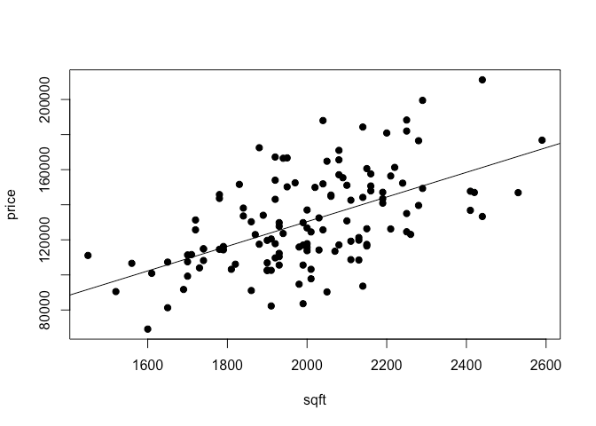
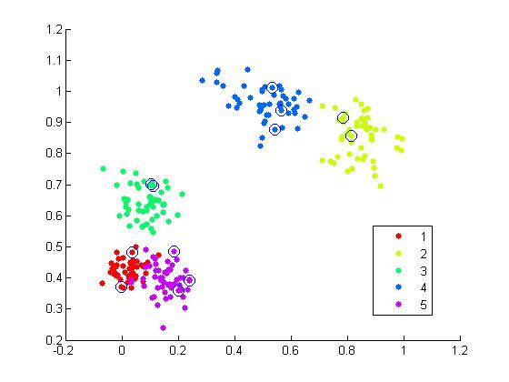
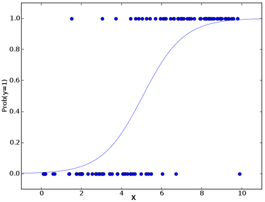
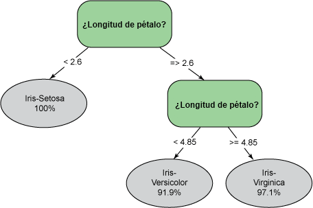

Introducción a Machine Learning
========================================================
author: CM-072

Machine Learning(Aprendizaje Automático)
=======================================================
Es una rama de la inteligencia artificial que estudia el diseño de algoritmos que puedan aprender. 

Típicas tareas del machine learning son el aprendizaje de conceptos,el desarrollo de  modelos de predicción,  la búsqueda de patrones predictivos y el clustering. 

Estas tareas son aprendidas  a través de los datos disponibles observados  a través de experiencias o instrucciones.

Aplicaciones
========================================================

Existen aplicaciones de Machine Learning en numerosas ramas de la ciencia. Por ejemplo:

- Procesamiento del Lenguaje Natural.
- Sistemas de Recuperación de Información.
- Juegos.
- Sistemas de Recomendación.
- Análisis de imágenes.
- Finanzas e Industria bancaria.
- Diagnóstico Médico.

Lista de algunos algoritmos en Machine Learning
========================================================

- [**Linear Regression**](https://jeremykun.com/2013/08/18/linear-regression/).
- [**Decision Tree**](https://jeremykun.com/2012/10/08/decision-trees-and-political-party-classification/).
- [**SVM**](http://www.analyticsvidhya.com/blog/2015/10/understaing-support-vector-machine-example-code/).
- [**KNN**](https://jeremykun.com/2012/08/26/k-nearest-neighbors-and-handwritten-digit-classification/)
- [**K-Means**](https://jeremykun.com/2012/10/08/decision-trees-and-political-party-classification/).
- [**Naive Bayes**](http://www.analyticsvidhya.com/blog/2015/09/naive-bayes-explained/).
- [**Dimensionality Reduction Algorithms**](http://www.kdnuggets.com/2015/05/7-methods-data-dimensionality-reduction.html).

Categorias del Machine Learning
========================================================

Podemos dividir los problemas de Machine Learning en 3 grandes categorias:

- **Aprendizaje supervisado**
 * Regresión.
 * Clasificación
- **Aprendizaje no supervisado**
 * Clustering
 * Reducción de la dimensión.
- **Aprendizaje por refuerzo**
 
 
Datos de entrenamiento, validación y de prueba
======================================================

- Los datos de entrenamiento(**Training**): son los datos que entrenan los modelos
- Los datos de validación (**Validation**) : elecciona el mejor de los modelos entrenados.
- Los datos de prueba (**Test**): Nos ofrece el error real cometido con el modelo seleccionado.

[Hastie, Tibshirani y Friedman](http://www-stat.stanford.edu/~tibs/ElemStatLearn/) en su libro *The Elements of Statistical Learning* indican que una división típica para estos conjuntos puede ser de 50% para el entrenamiento y 25% para la validación y prueba, respectivamente.

Aprendizaje supervisado 
=======================================================
[*Del Wikipedia*](https://es.wikipedia.org/wiki/Aprendizaje_supervisado):

El aprendizaje supervisado es una técnica para deducir una función a partir de datos de entrenamiento.  La salida de la función puede ser un valor numérico (como en los problemas de regresión) o una etiqueta de clase (como en los de clasificación).

*En esencia*  lo que deseamos es formular algún tipo de regla o correspondencia que nos permita dar (o aproximar) la respuesta para todos los objetos que se nos presenten.

Regresión
=======================================================
*En esencia*: Trata de fijar una función  que describe una curva,de manera que pase lo más cerca posible a todos los datos.

Clasificación
=======================================================
*En esencia*: los datos  pertenecen a dos o más clases y queremos aprender a partir de lo que ya conocemos cómo clasificar nuevos datos. 

Regresión Logistica
=======================================================
Se utiliza para estimar los valores discretos sobre un conjunto dado de variables  independientes. En decir predice la probabilidad de ocurrencia de un evento mediante el ajuste de los datos a una [función logit](https://en.wikipedia.org/wiki/Logistic_function).

Árboles de decisión
=======================================================
- Es un tipo de algoritmo de aprendizaje supervisado que se utiliza sobre todo para problemas de clasificación. En este algoritmo, dividimos la población en dos o más conjuntos homogéneos. Esto se realiza en base a los atributos más significativos-variables independientes para obtener grupos tan distintos como sea posible.

- Para dividir la población en diferentes grupos heterogéneos, se utilizan diferentes técnicas como de Gini, Chi-cuadrado el  uso de la  entropía.

=======================================================
- **Un ejemplo**

Un árbol decisión es usado para clasificar la planta iris. Las clases posibles son: Iris-Setosa, Iris-Versicolor e Iris-Virginica.

Aprendizaje no supervisado
=======================================================
Se da cuando no hay un conocimiento a priori de las salidas que corresponden al conjunto de datos de entrada. En estos casos el objetivo es encontrar grupos mediante clustering o determinar una distribución de probabilidad sobre un conjunto de entrada.

En el caso de clustering el algoritmo tiene que descubrir esta similitud, la de no *mencionar explicitamente* que algunos datos permanecen a una clases y otros no.

Clustering
=======================================================

*En esencia*: el proceso de organización de objetos en grupos cuyos miembros
son similares de alguna manera. 

K-means
=======================================================
Es un tipo de algoritmo no supervisado que resuelve el problema de Clustering. Su procedimiento sigue una manera simple y la  clasificar un determinado conjunto de datos a través de un cierto número de cluster.

Funcionamiento de K-Means
=======================================================

1. K-Means selecciona   k puntos para cada grupo conocido como centroides.
2. Cada dato forma un cluster con el centroide más cercano (k-clusters).
3. Encuentra  el centroide de cada grupo sobre la base de los miembros del clúster existentes.
Aquí tenemos nuevos centroides.
4. Como tenemos nuevos centroides, repetimos  los pasos 2 y 3. Encontramos la distancia más cercana para cada punto de datos desde los  nuevos centroides y  asociamos  con nuevos k-clusters. Repetimos  este proceso hasta que se produce convergencia

Aprendizaje por refuerzo
=======================================================

Determinar qué acciones debe escoger un agente de software en un entorno dado con el fin de maximizar un objetivo determinado.

**Ejemplos**:

- Procesos de decisión de Markov.
- Metodos de Montecarlo.
